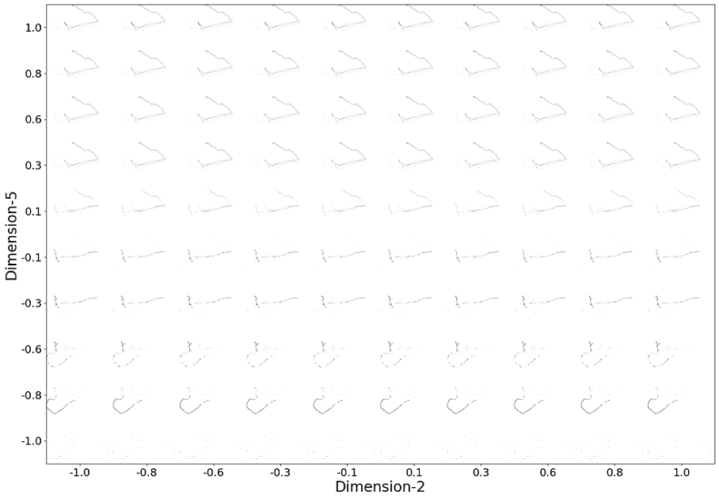

# Ship Navigation and Fuel Profiling based on Noon Report using Neural Network Generative Modeling

## MTEC/ICMASS-2022 N-DIGI-108
### J. Hadi, Tay Z. Y. (Singapore Institute or Technology)
### D. Konovessis (Strathclyde University)

---

**Abstract.** Harbor craft historical routes contain valuable information on how the
experienced crews navigate around the known waters while performing jobs. The noon
report logs each job timeframe which can be used to segregate the time-series positional
data as routes. Other information from the noon report such as fuel consumption could
be associated with a particular job as well. This paper offers a solution to encompass
crew navigational experience into neural network models. The variational autoencoder,
which is a generative model, can capture the routes into a knowledge base model. The
same variational autoencoder is also able to train other neural networks to make
predictions of route and fuel consumption based on job metadata (i.e., job duration,
activity area, and route classification). The predicted routes could be used as a cost map
for pathfinding algorithms such as A* or Dijkstra.

## 1. Introduction

This paper aims to capture a gold standard which is the crew’s experience as a knowledge base of the historical routes, in the form of a trained neural network. The knowledge base could be inferred to become a cost map, and consumed by pathfinding algorithms to generate a suggested route. 
This paper utilizes the noon report combined with external sources (i.e., positional/GPS). In addition, the same knowledge base could be inferred to profle (predict) fuel for the suggested route. 

## 2. Methodology

There are four steps as explained by a block diagram below. 
The final objective is to generate two outputs of Route Image (H) and Fuel Prediction (I) by step 4, from Job & Noon Report Metadata. 

### Dataset

Inputs (A) and (B) must first be prepared to complete all four steps in the block diagram. There are 405 ship jobs/routes from April to October 2020 collected from the subject vessel. For each route, the sequential GPS positions (1-min interval) are transformed to greyscale image, discarding the time-series information. The greyscale image is the Original Route Image (A). 

 

The Job & Noon Report Metadata comprises of two sets of data: (1) Job/Route Class/Pattern, and (2) Noon Report Metadata. The metadata is the activity area and the duration of the job. The sample of activity area is shown by dotted blue triangle in figure above (left, white background). 

Prior to classification/clustering for the route pattern, the routes are calculated for pair similarity using dynamic time-warping. Images below show an example case using route #387 and #379 on illustrated maps. 

The time-series positional coordinates are broken down into latitude and longitude elements. Latitude from each job is considered to measure the similarity distance using a dynamic time-warping algorithm. The same method is applied to the longitude. Figures below show the point-by-point associations for distance measurement. The cumulative absolute distance of latitude and longitude difference is combined by calculating a hypothenuse of the two. It is due to that the latitude and longitude are assumed to be orthogonal, thus ignoring the curvature of the earth.

The pair similarity distance for every pair combination is stored as a distance matrix. The visualized version of the distance matrix is shown in figure below. Each route’s distance with another is binned in a cell of a matrix (table). Hence, it is mirrored diagonally. The dark areas are the regions where the distance value is low indicating there is a close similarity with other members. In contrast, the bright areas (lines) are the part where the distance value is high. From figure below, it can be observed that there are members (routes) that do not have similarities with other members (the routes with white lines), hence a unique route. 

The agglomerative hierarchical clustering is used to cluster using the distance matrix to class labels. The clustering criterion is either distance threshold or number of classes. 

Similar routes have the same class label indicating the cluster association. Figures below show the other cluster members in the same cluster as route #387. Routes #98, #228 & #400 (left to right). The greyscale images are inverted. 

The Job & Noon Report Metadata (B) set forms the train and the test dataset as shown below. 

The dataset is to be normalized, and exclusively for the route class, it is one-hot encoded. 

### Modeling

The step 1 in the block diagram uses variational encoder (VAE) network. The configurations for both Encoder and Decoder networks are shown below. 

   

Figures below show the configuration for Feature (left) and Prediction (right) network. 

 

The well-trained VAE (especially the encoder) establishes the latent space which the routes could be fit into a continuous multi-dimensional latent representation. Figure below shows the tiled 2D slice results (route reconstruction by decoder network) from multi-dimensional latent space. 

## 3. Results

As shown by step 4 in the block diagram (the final model), there are two sets of results, the Reconstructed Route Image (H) and the Fuel Prediction (I). 

### Route

Two rows of figures below show the images of original route (top row) versus the reconstructed result (bottom row). All greyscale images are inverted (route #22, #264, #288, #383, #387 respectively).

Refer to the paper for detailed discussion of the route results. The reconstructed result as shown by one of the route is transformed to a cost map (#264). 

Figures below show the transformation. Left and center are the original and the inverted original as output by the final model. Right is the cost map for pathfinding algorithm after transformation. 

Image below (left) is the original route over the cost map. The application of two pathfinding algorithms over the cost map are shown by the center (A*) and right (Dijkstra) images. 

### Fuel

Table below shows the results of fuel profile for each test route/job. The results compare the actual observation versus the prediction. Refer to the paper for more detailed discussion in relation to fuel profiling/prediction. 

## 4. Conclusion

The results presented in this paper demonstrate that not only is it possible to profile the navigation route and fuel consumption, but also able to perform well. The solution presented in this paper can become a tool on which other methods are applied, such as various pathfinding algorithms and its derivations/customizations accounting for other factors such as weather situation.

---
